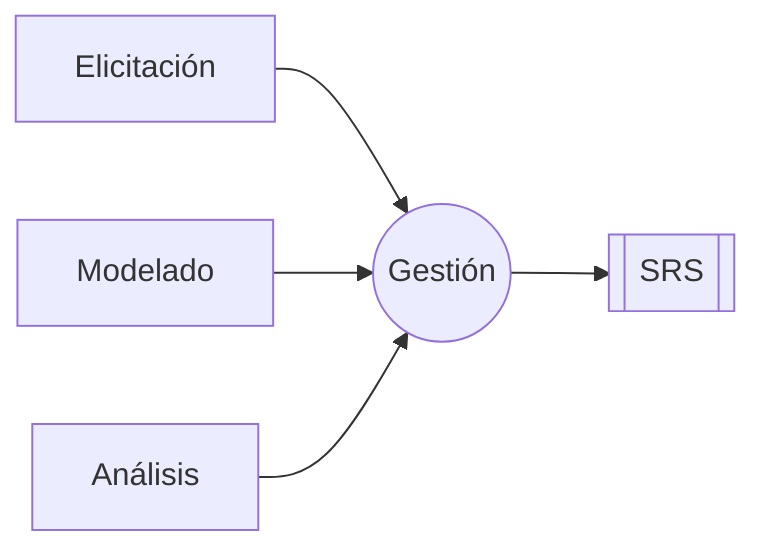
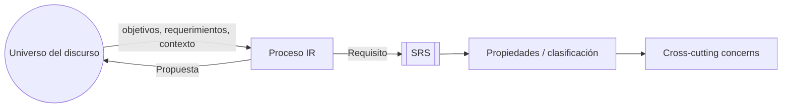

# Evolución de los Requisitos

## Transcripción

- **50%** cambian / evolucionan.

## Requisitos

1. Van a cambiar.
2. Van a ser mal comprendidos.

## Ingeniería de Requisitos

## Requisito

**Concepto + representación**

## Nota inferior

- Esquema que permite ver los req cuando hay muchos componentes externos.
